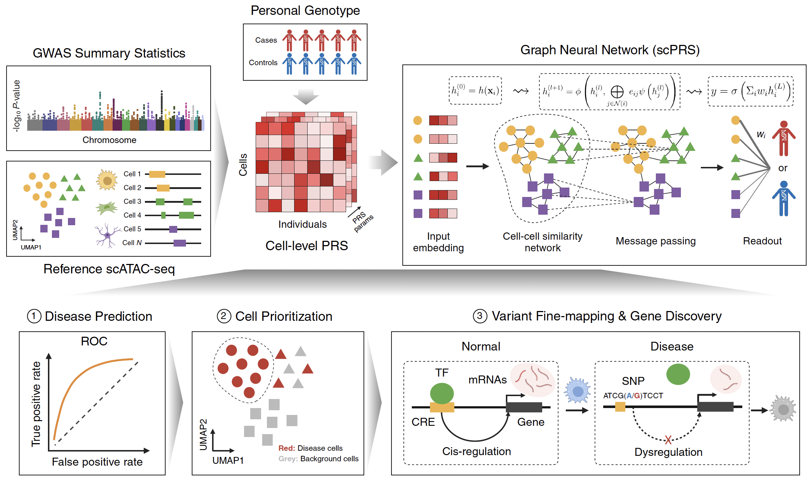

# scPRS: Single-Cell Polygenic Risk Score

## About
This directory contains the code and resources of the following manuscript:

Zhang et al., Deconvolution of polygenic score in single cells unravels cellular heterogeneity of complex human diseases, *bioRxiv*, 2024. **doi**: https://doi.org/10.1101/2024.05.14.594252

## Overview
We introduce scPRS, an interpretable geometric deep learning model that contructs single-cell-resolved PRS leveraging reference single-cell ATAC-seq data for enhanced disease prediction and biological discovery.

<p align="center">
 
</p>

## Dependencies 
- pytorch
- pytorch_geometric
- pandas
- sklearn
- argparse
- networkx
- numpy
- anndata
- scanpy
- plink

## Usage
1. Conduct quality controls for your discovery and target cohorts. We recommend to follow the PRS [tutorial](https://choishingwan.github.io/PRS-Tutorial/).
2. Compute cell-level PRSs based on single-cell ATAC-seq peaks using PLINK clumping and thresholding (C+T) method. Still follow the [tutorial](https://choishingwan.github.io/PRS-Tutorial/) but use `--clump-index-first` to force index SNPs to be drawn from peak regions.
3. Prepare your input data, including cell-level PRS feature matrix, cell-cell similarity network, and sample labels. We have provided an example script `util/generate_data.py`.
4. Run the scPRS model. The processed data from Step 3 are used to generate the disease-cell associations. An example command is given by
``` bash
python3 main.py --data_path {input data path} --model_save_path {model saving path} --result_path {result saving path} 
```
`data_path` denotes a pickle file which contains the processed input data. The pickle file can be generated using `util/generate_data.py`. `model_save_path` denotes the path to save the trained model. `result_path` denotes the output file, which contains cell weights from different repeats. Other hyperparameter settings can be found in the script.

5. Identify disease-relevant cells whose weights are consistently larger than the majority of cell weights. An example script is given by `util/analysis.py`.

If you have any questions, please feel free to contact Sai Zhang (sai.zhang@ufl.edu).

## License
scPRS is licensed under the MIT License.
